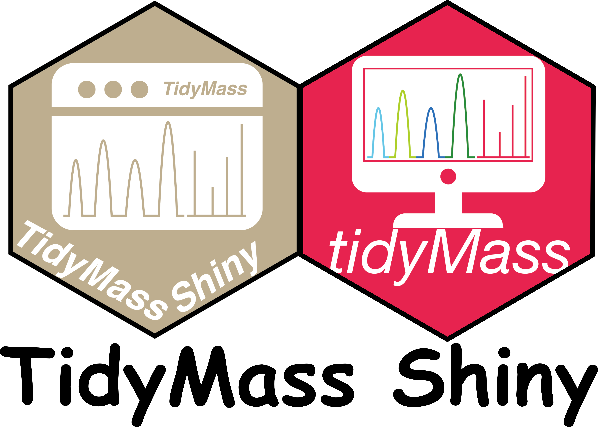

[](https://www.r-project.org)  [](https://opensource.org/licenses/MIT)  [](https://www.tidymass.org/)   


A user-friendly shinyapp designed for metabolomics data analysis within the **tidymass** framework.


# Quick start

## Install

```  r
##> for chinese users:
##> options("repos" = c(CRAN="https://mirrors.tuna.tsinghua.edu.cn/CRAN/"))
##> options(BioC_mirror="https://mirrors.westlake.edu.cn/bioconductor")


if (!require('remotes')) install.packages('remotes');
if (!require('tidyverse')) install.packages('tidyverse');

## Install tidymass follow: https://www.tidymass.org/docs/chapter1/1-installation/

if (!require('tidymass')) {
  source("https://www.tidymass.org/tidymass-packages/install_tidymass.txt");
  install_tidymass(from = "tidymass.org")
};
if (!require('writexl')) install.packages("writexl");
if (!require('hexbin')) install.packages('hexbin')
if (!require('ComplexUpset'))install.packages('ComplexUpset');
if (!require('shinyalert'))install.packages('shinyalert');
if (!require('shinyFiles')) remotes::install_github('thomasp85/shinyFiles');
if (!require('shinyWidgets')) remotes::install_github("dreamRs/shinyWidgets");
if (!require('shiny')) install.packages('shiny');
if (!require('bsicons')) install.packages('bsicons');
if (!require('bslib')) install.packages('bslib');
if (!require('plotly')) install.packages('plotly');
if (!require('colourpicker')) install.packages('colourpicker');
if (!require('massdbbuildin')) remotes::install_github('tidymass/massdbbuildin');
if (!require('tidymassshiny')) remotes::install_github('tidymass/tidymass_shiny')
```

# Start

```r
library(tidyverse)
library(tidymass)
library(tidymassshiny)
run_tidymass_shiny()
```


# Reference


# Citation
